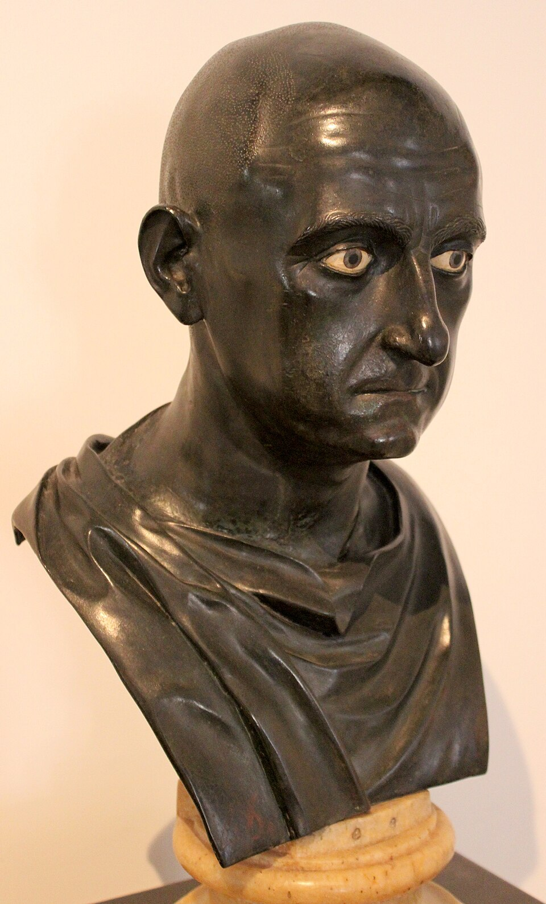
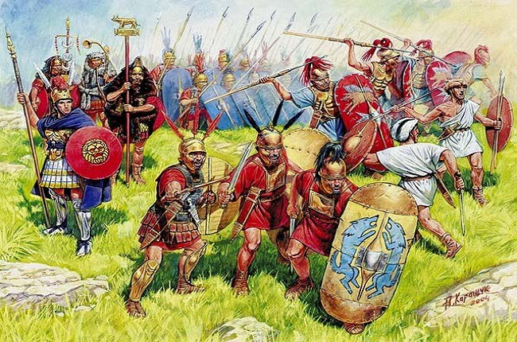

# El Joven que Desafió a un Imperio

Había una vez, en una tierra llamada Hispania, un joven romano llamado Publio Cornelio Escipión. No era un joven cualquiera. Llevaba en sus hombros el peso de una República en guerra y el recuerdo de su padre y su tío, caídos en esa misma tierra luchando contra los poderosos cartagineses.

Los cartagineses, liderados por el legendario Aníbal, dominaban Hispania. Sus ejércitos, reforzados por valientes guerreros íberos, parecían invencibles. Pero Escipión, con solo 24 años, no sentía miedo, sino una determinación de hierro.

**El Desembarco en Hispania**

> "Si todos los quirites desean hacerme edil, tengo los años suficientes." - Publio Cornelio Escipión

Escipión llegó a Hispania y encontró un ejército romano desmoralizado. Pero en sus ojos no había duda, sino la llama de la esperanza. Les habló de vengar a sus caídos, de liberar Hispania y de llevar la guerra al corazón de Cartago.

**La Conquista de Qart Hadasht**

La joya de los cartagineses en Hispania era la ciudad de Qart Hadasht (la actual Cartagena), una fortaleza inexpugnable rodeada por el mar y una laguna. Asdrúbal, el hermano de Aníbal, se sentía seguro en el interior de la península.

Pero Escipión era un estratega audaz. En un ataque relámpago, tan rápido que pareció un susurro del viento, tomó la ciudad. Y aquí, el joven romano demostró que su grandeza no solo residía en el campo de batalla. Prohibió el saqueo, respetó la vida de sus habitantes y liberó a los rehenes íberos que los cartagineses retenían.

Entre los rehenes se encontraban las familias de muchos líderes íberos. Jefes como Indíbil y Mandonio, hasta entonces fieles a Cartago, vieron en Escipión no a un conquistador, sino a un liberador.

**La Furia de los Íberos y la Astucia de Escipión**

Los íberos eran un pueblo orgulloso, de espíritu indomable. No eran marionetas de nadie. Luchaban por su tierra y su gente. Al principio, muchos se unieron a los cartagineses, a quienes veían como un mal menor frente a la arrogancia de Roma.

Pero la clemencia de Escipión en Qart Hadasht sembró la duda en sus corazones. ¿Y si este romano era diferente? ¿Y si él sí respetaría sus costumbres y su libertad?

En la batalla de Baecula, Escipión se enfrentó a Asdrúbal. Los íberos, en ambos bandos, lucharon con una fiereza legendaria. Escipión, con su genio militar, logró la victoria, pero Asdrúbal consiguió escapar con gran parte de su ejército. El romano había ganado una batalla, pero no la guerra.

La batalla decisiva en Hispania se libró en Ilipa. Fue una danza mortal de legiones romanas, elefantes cartagineses y guerreros íberos. Escipión, con una maniobra que aún se estudia en las academias militares, aplastó a los ejércitos cartagineses. Hispania, después de años de lucha, caía bajo el control de Roma.

**El Duelo de Titanes: Escipión contra Aníbal**

Con Hispania conquistada, Escipión llevó la guerra a África, a las puertas de Cartago. Aníbal, el terror de Roma, fue llamado para defender su patria. El destino del mundo conocido se decidiría en la llanura de Zama.

Dos de los más grandes generales de la historia se encontraron frente a frente. Aníbal, un veterano curtido en mil batallas, con sus temibles elefantes. Escipión, el joven prodigio, con sus legiones disciplinadas y la caballería númida de su nuevo aliado, Masinisa.

La batalla fue un choque de titanes. El polvo se levantaba ocultando el sol, el estruendo de las espadas y los gritos de los hombres resonaban en el aire. Al final del día, el genio de Escipión se impuso. Aníbal fue derrotado.

**El Legado de un Héroe**

Escipión, aclamado como "el Africano", regresó a Roma como un héroe. Pero él nunca olvidó a los pueblos que había encontrado en su camino. Respetó a los cartagineses, a los que impuso una paz dura pero no aniquiladora. Y admiró a los íberos, cuya valentía y amor por la libertad le habían impresionado profundamente.

La historia de Escipión no es solo la de una conquista, sino la de un hombre que, en una época de violencia y brutalidad, supo ser magnánimo en la victoria y respetuoso con sus enemigos. Un hombre que entendió que la verdadera grandeza no está en someter a los pueblos, sino en ganarse su respeto.
